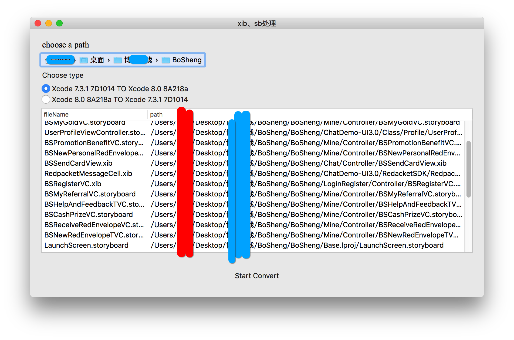

## For various reasons, I still use Xcode 7.3.1. But sometimes we need Back and forth on Xcode 7 and Xcode 8, just because some old proj's Swift 2.3 convert to 3.0 is very difficult and Like a mountain of work...

## so the Rudimentary tools appeared !

